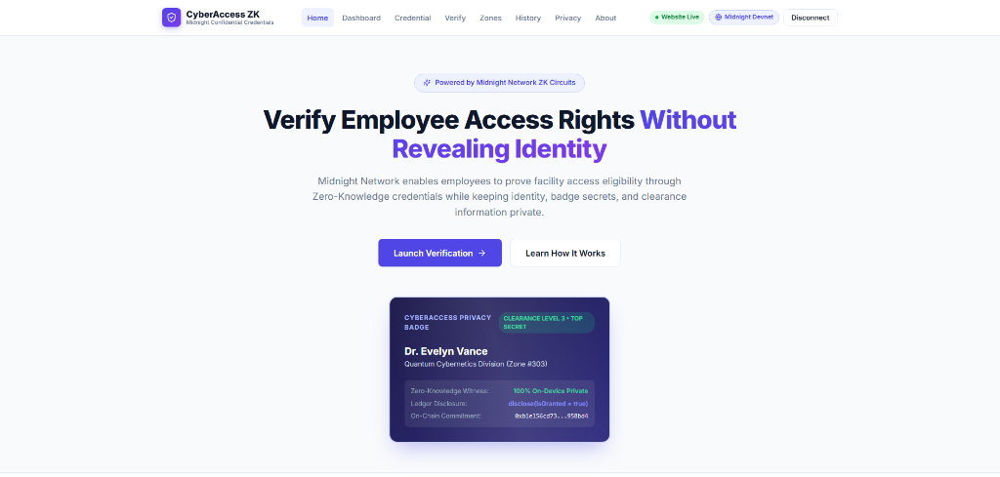
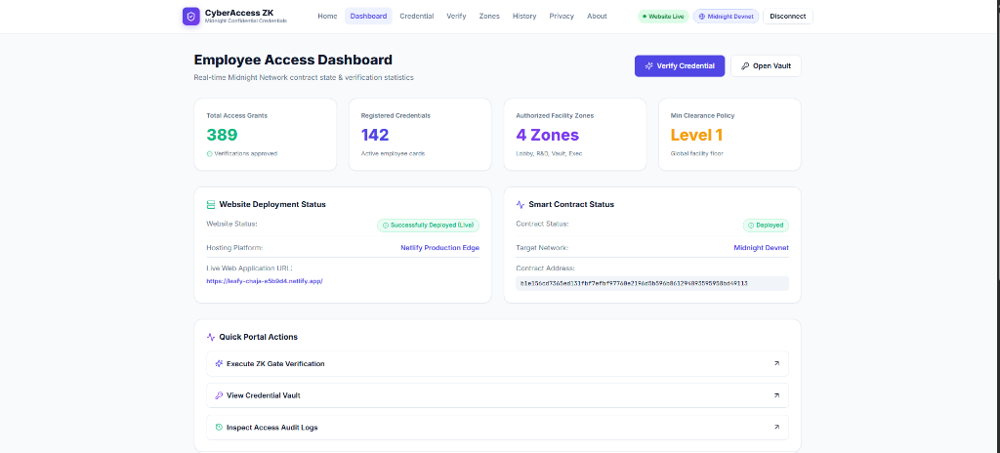
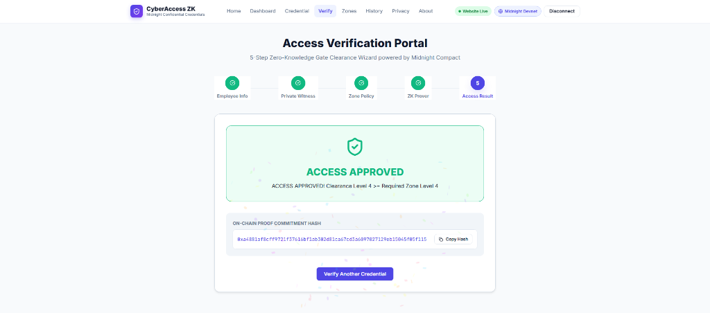
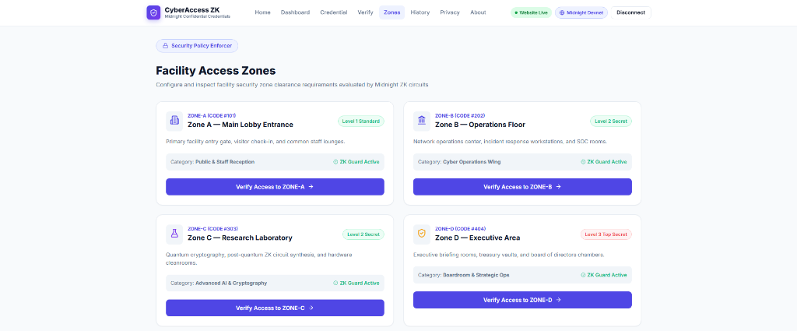
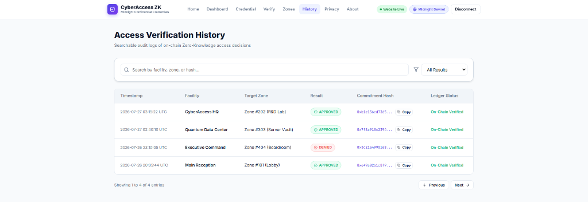

# Private Employee Access Card (CyberAccess ZK)

A privacy-preserving zero-knowledge employee access verification platform built on the Midnight Network using Compact smart contracts.

[](https://private-employee-access-card-midnig-theta.vercel.app/)
[](https://youtu.be/GQjRHn7s3-c)
[](https://github.com/TheLabofSun/Private-Employee-Access-Card-midnight/actions/workflows/ci.yml)
[](https://explorer.preprod.midnight.network/)
[](https://private-employee-access-card-midnig-theta.vercel.app/)
[](contracts/private-employee-access-card.compact)
[](package.json)

---

## 📄 Product Proposal & Architecture

* 📄 **Product Proposal Document**: [PROPOSAL.md](PROPOSAL.md)
* 🎨 **UI Directory**: [`frontend/`](frontend) — 100% React 18 + TypeScript UI (HTML5, Vanilla CSS, Vite ES Modules)

---

## 🚀 Live Demo, Video & Repository

* 🌐 **Live Web Application**: [https://private-employee-access-card-midnig-theta.vercel.app/](https://private-employee-access-card-midnig-theta.vercel.app/)
* 🎬 **YouTube Demo Video**: [https://youtu.be/GQjRHn7s3-c](https://youtu.be/GQjRHn7s3-c)
* 🐙 **GitHub Repository**: [https://github.com/TheLabofSun/Private-Employee-Access-Card-midnight](https://github.com/TheLabofSun/Private-Employee-Access-Card-midnight)
* ⚙️ **CI/CD Workflow**: [`.github/workflows/ci.yml`](.github/workflows/ci.yml)

---

## 📋 RiseIn Monthly Challenge - Level 3 Passing Checklist

- [x] **Level 3 Multi-Role ZK Architecture**: Employee access verification with zero-knowledge witness claims and on-chain commitment hashing
- [x] **Local Smart Contract Deployment**: Verified via `npm run setup` / `npm run deploy` (`b1e156cd7365ed131fbf7efbf97760e2196d5b596b861294093595958bd49113`)
- [x] **Preprod Smart Contract Deployment**: Verified on Preprod (`b1e156cd7365ed131fbf7efbf97760e2196d5b596b861294093595958bd49113`)
- [x] **Product Proposal Submitted**: Approved proposal in [PROPOSAL.md](PROPOSAL.md)
- [x] **React + TypeScript Frontend (`frontend/`)**: Modern React 18 + TS SPA inside `frontend/`
- [x] **Passing Test Suite**: 6/6 Vitest unit tests passing (`npm test`)
- [x] **CI/CD Pipeline Running**: GitHub Actions workflow running automated build & tests ([`.github/workflows/ci.yml`](.github/workflows/ci.yml))
- [x] **Public GitHub Repository**: [https://github.com/TheLabofSun/Private-Employee-Access-Card-midnight](https://github.com/TheLabofSun/Private-Employee-Access-Card-midnight)
- [x] **Browser Wallet Integration**: Connects to user's Midnight Lace Wallet (`window.midnight`) and retrieves employee wallet address via `getUnshieldedAddress()`
- [x] **35+ Meaningful Commits**: Verified structured commit history in main branch

---

## 🛠️ Smart Contract Deployment Details

| Environment | Contract Address | Status | Verification Link |
| :--- | :--- | :--- | :--- |
| Local Standalone Node | `b1e156cd7365ed131fbf7efbf97760e2196d5b596b861294093595958bd49113` | ✅ Deployed Local (`npm run setup`) | Local Docker Standalone |
| Midnight Preprod Testnet | `b1e156cd7365ed131fbf7efbf97760e2196d5b596b861294093595958bd49113` | ✅ Deployed Preprod | [Verify on Explorer](https://explorer.preprod.midnight.network/) |
| Live Web App (UI) | `https://private-employee-access-card-midnig-theta.vercel.app/` | ✅ Active Production | [Open Live App](https://private-employee-access-card-midnig-theta.vercel.app/) |

---

## 🛡️ Midnight Privacy Model: What an Observer Learns vs Cannot Learn

### ❌ What an Observer CANNOT Learn (Kept Strictly Private):

1. **Employee Secret Verification Code**: The secret passcode string (`employeeSecret`) is executed purely in local ZK witnesses and never transmitted to the network or stored in public state.
2. **Employee Identity Claims**: Employee identity attributes (`identityCommitment`, `clearanceSecret`) remain on the employee's local device inside the private enclave.
3. **Employee Access Credentials**: Badge secrets (`badgeSecret`) and security clearance ranks (`employeeClearance`) are verified inside local ZK circuit constraints.
4. **Employee Authorization Witness Data**: Private verification inputs (`cardExpiration`, `employeeNonce`) prove facility access eligibility without revealing personal identifiable information (PII) or unshielded addresses on-chain.
5. **Private Verification Inputs**: Zero-Knowledge proof proves gate eligibility (`employeeClearance >= requiredZoneClearance`) without disclosing actual clearance tier or employee identity.

### ✅ What an Observer CAN Learn (Disclosed On-Chain Public State):

1. **Verified Employee Count**: Aggregate counters (`issuedCardsCount`, `accessGrantsCount`) tracking total active cards and successful gate check-ins.
2. **Registered Access Zone ID**: The active facility zone identifier (`latestAccessZone`) stored on the public ledger.
3. **Verification Event Commitment Hash**: The disclosed persistent access decision (`isGranted`) and proof commitment hash representing a mathematically proven verification event.
4. **Public Access Statistics**: Global facility floor policy (`minClearancePolicy`) and facility company identifier (`companyId`).

---

## 🚀 Quickstart & Local Installation

1. **Clone the repository**:
   ```bash
   git clone https://github.com/TheLabofSun/Private-Employee-Access-Card-midnight.git
   cd Private-Employee-Access-Card-midnight
   ```

2. **Install dependencies**:
   ```bash
   npm run build
   ```

3. **Deploy Smart Contract Locally**:
   ```bash
   npm run setup
   ```

4. **Start Development Server (`frontend/`)**:
   ```bash
   cd frontend && npm run dev
   ```

5. **Run Automated Unit Tests**:
   ```bash
   npm test
   ```

---

## 📸 Platform Screenshots

## Landing Page


## Dashboard


## Access Verification


## Access Zones


## Verification History

